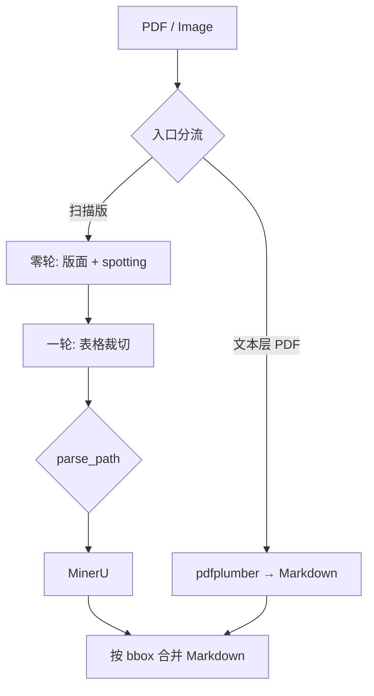

# OCR MD

面向复杂版面的高精度文档解析配套工程：**轻量产线**通过云端 API（Paddle AI Studio + MinerU）完成多轮 OCR，将 PDF / 图片统一输出为 Markdown。

适用于扫描件、复杂表格、模糊文档等场景；设计与论文方法（P0–P2 路径）同构，可在无本地 GPU 的环境下运行。

---

## 功能概览

- **多格式入口**：PDF、PNG、JPG、JPEG、HEIF/HEIC
- **PDF 智能分流**：文本层 → pdfplumber 短路；扫描版 → PyMuPDF 分页渲染
- **多轮 OCR**：零轮（整页）→ 一轮（表格区）→ 二轮（子表）
- **四条路径**：`P0` | `P1` | `P2-M1` | `P2-M2`
- **全 API**：版面 / spotting（AI Studio）+ 深度解析（MinerU batch）
- **批处理**：文档/页级并行、QPS 限流、失败清单 `failed_tasks.csv`
- **模糊模式**：`--blur-sensitive` 降低版面置信度



---

## 仓库结构

```
.
├── lightweight_pipeline/     # 可运行轻量产线（主代码）
│   ├── run.py
│   ├── config.example.yaml   # 脱敏示例配置（提交到 git）
│   ├── requirements.txt
│   └── lp/                   # 包：clients / core / batch
├── mineru_precision_api.py   # MinerU 云端 API 客户端
├── samples/                  # 公开样例（无隐私）
├── docs/
│   ├── paper/                # 论文章节整理
│   └── deploy/               # MinerU / PaddleOCR 部署参考
├── LICENSE
└── SECURITY.md
```

---

## 快速开始

### 1. 安装依赖

```bash
cd lightweight_pipeline
pip install -r requirements.txt
```

可选：系统安装 `heif-converter`（处理 HEIF/HEIC）。

### 2. 配置 Token（勿提交）

```bash
cp config.example.yaml config.yaml
# 编辑 config.yaml，填写 MinerU / AI Studio Token
```

或使用环境变量（优先于配置文件）：

```bash
# Linux / macOS
export MINERU_TOKEN="..."
export AISTUDIO_TOKEN="..."

# Windows PowerShell
$env:MINERU_TOKEN="..."
$env:AISTUDIO_TOKEN="..."
```

| 变量 | 说明 |
|------|------|
| `MINERU_TOKEN` | [MinerU](https://mineru.net) 精准解析 Token |
| `AISTUDIO_TOKEN` | Paddle AI Studio Token（版面与 spotting 共用） |
| `AISTUDIO_LAYOUT_TOKEN` | 仅覆盖版面 Job（可选） |
| `AISTUDIO_SPOTTING_TOKEN` | 仅覆盖 spotting Job（可选） |

### 3. 运行

```bash
python run.py --config config.yaml ../samples/diagram-flowchart.png
python run.py --config config.yaml --parse-path P1 scan.pdf
python run.py --config config.yaml --blur-sensitive blur_scan.pdf
```

输出默认写入 `lightweight_pipeline/output/{doc_id}/`。

---

## 解析路径

| 路径 | 说明 |
|------|------|
| **P0** | 整页直调 MinerU（基线/快速） |
| **P1** | 一轮表格 → MinerU；非表格来自零轮（默认） |
| **P2-M1** | 二轮 spotting + 扩边 → MinerU（偏文本） |
| **P2-M2** | 二轮表图直调 MinerU（偏结构） |

更多细节见 [`lightweight_pipeline/README.md`](lightweight_pipeline/README.md)。

---

## 文档

| 文档 | 内容 |
|------|------|
| [论文总览](docs/paper/overview.md) | 摘要 + 引言 + 方法合并稿 |
| [Abstract](docs/paper/abstract.md) / [Introduction](docs/paper/introduction.md) / [Method](docs/paper/method.md) | 分章源稿 |
| [MinerU API](docs/deploy/mineru-api.md) | 云端精准解析 API |
| [MinerU Docker](docs/deploy/mineru-docker.md) | 本地 Docker 部署 |
| [PaddleOCR 模块](docs/deploy/paddleocr-modules.md) | 模块与本地部署汇总 |
| [PaddleOCR-VL Docker](docs/deploy/paddleocr-vl-docker.md) | VL 本地部署参考 |
| [SECURITY.md](SECURITY.md) | 密钥与漏洞说明 |

---

## 已知限制

- `mode: high_precision`（本地 GPU 产线）尚未实现，当前仅 **lightweight**
- PP-TableMagic 未接入
- 不支持「同文档混合文本层 + 扫描页」PDF
- `paddle_detection` / `paddle_recognition` 默认关闭，由 AI Studio spotting 替代

---

## 贡献与许可

欢迎 Issue / PR。提交前请确认：

- 未包含 `config.yaml`、真实 Token、私有文档或 `work/` / `output/` 产物
- 新增样例已脱敏

本仓库代码以 [MIT License](LICENSE) 发布。论文叙述与第三方产品名称归各自权利人所有。
