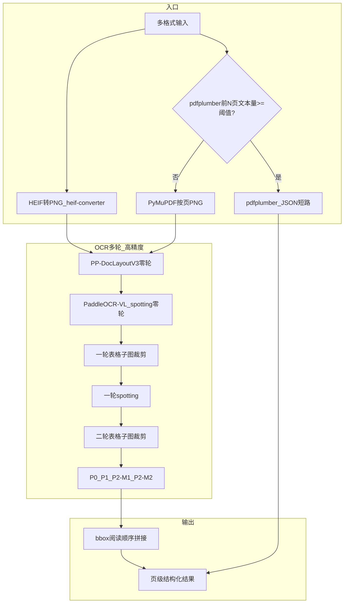
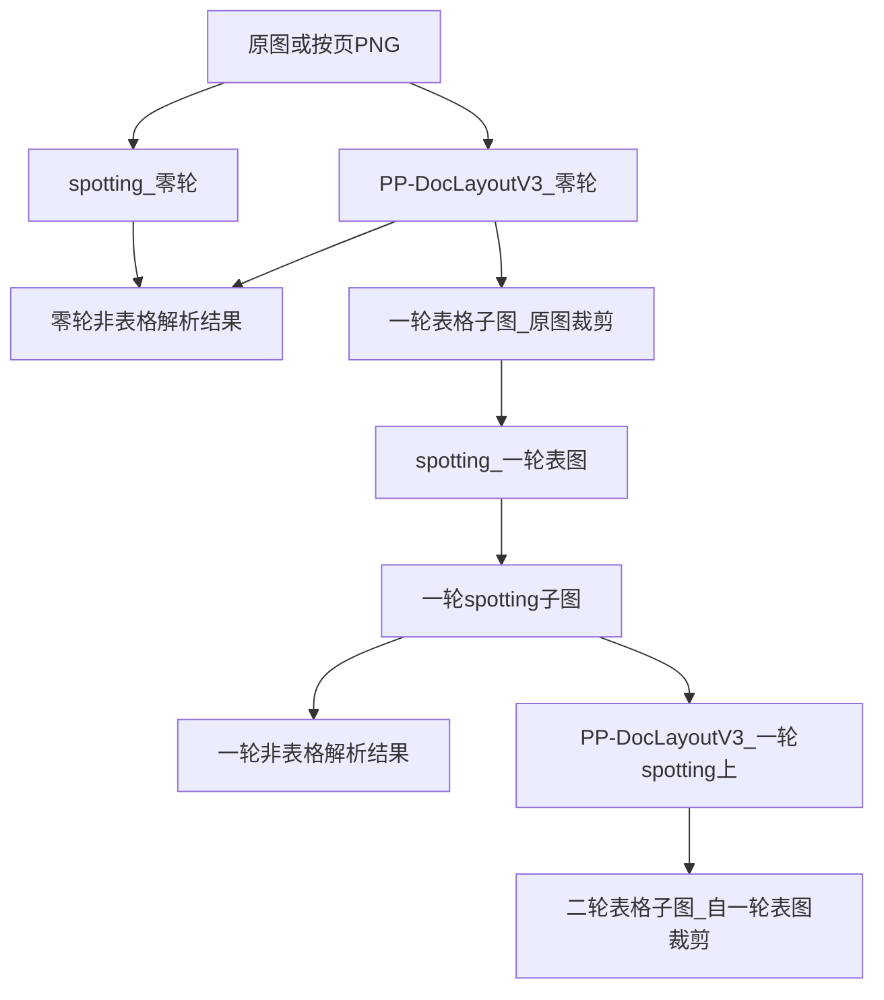
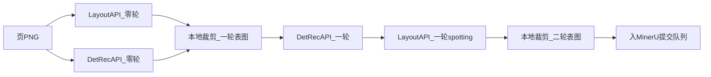

# 3 Method：高精度文档解析方案

本章阐述面向 **复杂表格结构** 与 **扫描版/极度模糊文档** 的高精度解析方法，与 Introduction §1.7.1 所预告的开源能力编排方案一一对应。第 4 章给出与之 **同构、可切换** 的轻量化产线（§1.7.2）。

---

## 3.1 系统总览

### 3.1.1 设计目标与架构定位

本文方法 **不从零训练单一超大模型**，而是在 **复用与编排现有开源能力** 的前提下，形成可落地、可验证的两套解析路径：

| 路径 | 部署形态 | 核心能力组合 |
|------|----------|--------------|
| **高精度路径（本章）** | 本地 / 自托管（Docker + 模型权重 + vLLM 等） | PP-DocLayoutV3 + PaddleOCR-VL-1.5 spotting + MinerU2.5-Pro-2604-1.2B |
| **轻量路径（第 4 章）** | 全官网 API（Paddle 云端 + MinerU 云端精准解析） | 文字检测 API + 识别 API 替 spotting；**裁剪与 P0–P2 编排同构** |

高精度路径面向 **复杂报关/表单类扫描表格** 等难例：单轮整页 VLM 解析与真值差距大，需 **多轮版面切分、spotting 保真与 MinerU 结构解析** 的组合。

### 3.1.2 端到端数据流

```
多格式输入 (PDF/PNG/JPG/JPEG/HEIF/HEIC)
    → 格式归一化 (HEIF/HEIC → PNG)
    → [PDF] 前 N 页 pdfplumber 试提取 → 文本层? 
         ├─ 是 → pdfplumber 表格模式 → JSON → Markdown（短路输出）
         └─ 否 → PyMuPDF 按页渲染 PNG
    → [扫描图像] OCR 多轮支线（§3.3）
         → 用户/API 指定 P0 | P1 | P2-M1 | P2-M2
    → bbox 阅读顺序拼接 → 页级结构化输出
```

### 3.1.3 符号与中间产物命名

| 符号 | 含义 |
|------|------|
| **零轮** | 以 **原图（或按页 PNG）** 为输入的第一阶段 |
| **一轮** | 以 **一轮表格子图**（自原图裁剪）为输入的阶段 |
| **二轮** | 以 **二轮表格子图**（自一轮表格子图再裁剪）为输入的阶段 |
| **spotting 子图** | 同尺寸空白画布 + spotting（或轻量路径下检测+识别）映射的文字 |
| **非表格解析结果** | 版面 label 非 `table` 区域内，按空间顺序回填的文本 |
| **P0–P2** | 四条「总解析路径」标识（§3.3.5） |

### 3.1.4 系统级流程图



---

## 3.2 文档入口与格式归一化

### 3.2.1 支持格式与统一中间表示

系统入口接受以下格式：

`PDF`, `PNG`, `JPG`, `JPEG`, `HEIF`, `HEIC`

- **HEIF / HEIC**：使用 **heif-converter** 转为 **PNG**；
- **JPG / JPEG**：统一规范为 **PNG** 中间表示，便于下游 PP-DocLayoutV3、spotting 与 MinerU 等模块一致处理。

### 3.2.2 PDF 类型判定

pdfplumber **不具备 OCR 能力**，对纯扫描 PDF 几乎无有效输出。入口采用 **先试后分流** 策略：

```
probe = pdfplumber_extract(first_N_pages)   # N 可配置
if char_count(probe.text) < THRESHOLD:
    branch = SCANNED      # → §3.2.4
else:
    branch = TEXT_LAYER   # → §3.2.3
```

- **前 N 页试提取**：在判型成本与准确性之间折中；
- **THRESHOLD**：可配置，具体默认值与敏感性分析留实验章；
- **范围约束**：**暂不考虑混合 PDF**（同一文档内部分页文本层、部分页扫描）。

### 3.2.3 文本层 PDF 短路路径

判定为 **文本层** 的 PDF：

1. 调用 **pdfplumber**，并 **开启表格提取模式**；
2. 从 PDF 内部文本对象 **直接提取文字与表格结构**；
3. 先得到 **JSON** 中间表示（pdfplumber **默认** 结构，不自定义 schema）；
4. 经 **JSON → Markdown** 转换（见 §3.2.3.1），输出 **Markdown** 作为该 PDF 的 **最终/主输出**；
5. **不进入** §3.3 OCR 多轮支线。

#### 3.2.3.1 pdfplumber JSON → Markdown 转换

转换规则（Method 级约定，实现可封装为 `pdfplumber_to_md`）：

| JSON 内容类型 | Markdown 映射 |
|---------------|---------------|
| 纯文本块 | 段落文本，段间空行 |
| 表格（pdfplumber 表格对象） | **Markdown 表格**（`\|` 分隔 + 表头分隔行） |
| 多页 | 按 **页序** 拼接，页间 `---` 或 `# Page k` 分隔（可配置） |

- **动机**：Markdown 便于 RAG 切片、LLM 消费与人审；JSON 仍可作为 **中间调试产物** 可选保留；
- **顺序**：保持 pdfplumber 提取的 **阅读顺序**（与 bbox 自上而下、从左到右一致时直接沿用）。

### 3.2.4 扫描版 PDF 栅格化

判定为 **扫描版** 的 PDF：

1. 使用 **PyMuPDF**（默认渲染参数）将 PDF **渲染为图像**；
2. **按页分离**，每页生成一张 **PNG**；
3. 各页 PNG 进入 §3.3 **扫描版复杂表格 OCR 多轮解析**。

---

## 3.3 扫描版复杂表格 OCR 多轮解析

### 3.3.1 问题设定与提取原则

**触发条件**：扫描版 PDF 按页 PNG，或直接上传的扫描类图像（如海关进口货物报关单等复杂表单）。

**核心矛盾**：对此类文档 **仅使用一轮模型整页解析**（如单轮 MinerU），效果往往与真值 **相差甚远**。因此需调用 **不同模型的不同能力**，以及 **同一模型产线内的细分模块**（版面检测、spotting、表格裁剪、MinerU 结构解析），逐级提高准确率。

**提取原则**：

| 区域类型 | 处理目标 |
|----------|----------|
| **非表格** | 提取为 **文本**，按版面标签区域 + **空间顺序** 回填 |
| **表格** | 保存为 **完整表格结构**，经 **零轮→一轮→二轮** 裁剪与重塑 |

**图示说明**（报关单样例）：

- **图 1（零轮版面）**：PP-DocLayoutV3 检出 `table`（如置信度 0.79）及多个 `text` 区域；
- **图 2（一轮表格子图）**：自原图裁剪的表格区域 **原图像素**；
- **图 3（一轮 spotting 子图）**：对一轮表格子图 spotting 后，文字映射到 **同尺寸空白画布**。

### 3.3.2 零轮：版面检测与 spotting

对 **原图（或按页 PNG）** 并行/顺序执行：

**（1）PP-DocLayoutV3 版面区域检测**

- 输出 `table`、`text` 等语义区域 **bbox** 及置信度；
- 为后续 **表格裁剪** 与 **非表格回填** 提供空间锚点。

**（2）PaddleOCR-VL-1.5 spotting**

- 对原图做 **文本检测与识别**；
- 将检出文字 **映射到相同尺寸的空白图片** 上，保存为 **零轮 spotting 子图**。

**（3）零轮非表格解析结果**

- 在零轮 spotting 结果中，对版面 label **非 table** 的区域；
- 将 spotting 文本按 **bbox 阅读顺序** 填入对应标签区域；
- 保存为 **零轮非表格解析结果**。

### 3.3.3 一轮：表格子图裁剪与 spotting

**（1）一轮表格子图**

- 根据零轮版面结果，将原图中 **所有 table 区域** 各自 **裁剪** 保存；
- 裁剪源为 **原图**，非 spotting 图，以保留原始像素供后续二轮切分。

**（2）一轮 spotting 子图**

- 对每个 **一轮表格子图** 调用 PaddleOCR-VL-1.5 **spotting**；
- 映射到空白画布，得到 **一轮 spotting 子图**（对应图 2 → 图 3）。

**（3）一轮非表格解析结果**

- 对 **一轮 spotting 子图** 再次运行 **PP-DocLayoutV3**；
- 对其中 **非 table** 标签区，按 **bbox 阅读顺序** 回填 spotting 文本；
- 保存为 **一轮非表格解析结果**。

### 3.3.4 二轮：细粒度表格切分与两种 MinerU 输入策略

在一轮 spotting 子图的版面检测中，可识别 **复杂表格内部的规则子表成分**。此时：

- **二次裁剪回到一轮表格子图**（**非** spotting 图），生成 **二轮表格子图**；
- 避免 spotting 映射失真影响 **细粒度结构切分**。

对 **二轮表格子图**，提供两种互斥策略（结构 vs 文本权衡）：

| | **模式一（P2-M1，偏文本正确性）** | **模式二（P2-M2，偏表格结构）** |
|---|-----------------------------------|-----------------------------------|
| spotting | **是**：二轮 spotting 子图 → **四向各扩 5% 空白** → 二轮 spotting 扩充子图 | **否**（该支路全程无 spotting） |
| MinerU 输入 | 各 **二轮 spotting 扩充子图** | 各 **二轮表格子图**（原图裁剪） |
| 假设 | 近似 **无线表** 上传 MinerU，spotting 提高 **文本正确性** | 保留 **局部原图结构**，提高 **表格结构准确度** |
| 代价 | **牺牲部分表格结构** | **牺牲文本层准确度** |

### 3.3.5 四条总解析路径（P0–P2）

用户或 API 参数指定以下 **一条** 路径作为该页的解析策略：

| ID | 名称 | 表格部分 | 非表格部分 | 说明 |
|----|------|----------|------------|------|
| **P0** | **零轮总解析** | 原图 **直接** MinerU2.5-Pro-2604-1.2B | 含于整页 MinerU 输出 | 无深度预处理；**基线/快速** 对照 |
| **P1** | **一轮总解析** | 各 **一轮表格子图** 直调 MinerU | **零轮非表格解析结果** | 表格不经 spotting 直解 |
| **P2-M1** | **二轮总解析·模式一** | 各 **二轮 spotting 扩充子图** → MinerU | **零轮 + 一轮** 非表格解析结果 | 文本优先 |
| **P2-M2** | **二轮总解析·模式二** | 各 **二轮表格子图** 直调 MinerU | **零轮 + 一轮** 非表格解析结果 | 结构优先 |

**MinerU 调用约定**：存在 **多个表格子图** 时，对每张 **逐张调用** MinerU2.5-Pro，再将各表解析结果 **合并** 进页级输出。

### 3.3.6 多轮预处理流水线（汇总）



---

## 3.4 极度模糊文档适配

极度模糊、低对比度、字体难以辨认的扫描件 **共用** §3.3 完整 OCR 多轮拓扑（零轮→二轮、P0–P2、bbox 拼接、逐张 MinerU）。

**不**另设独立图像预处理管线（如超分、去噪、二值化增强等）。

**适配策略**：调用 **Paddle** 相关模块（spotting / 文字检测）时 **降低检测阈值**，提高对模糊笔画的 **召回**，更敏锐地捕捉模糊文字。阈值具体数值与精度—误检权衡留 **§3.4 对应实验** 与 **第 4 章轻量检测 API** 对照实验。

---

## 3.5 页级输出与合并

### 3.5.1 bbox 阅读顺序拼接

无论 P0–P2 哪条路径，页级合并均遵循：

- 将 **表格块**（MinerU 输出）与 **非表格块**（零轮/一轮非表格解析结果）作为独立区域；
- 按各块 **bbox 阅读顺序**（版面框几何排序）**排列后拼接**；
- 恢复与原始版式一致的 **逻辑阅读顺序**。

### 3.5.2 多表格 MinerU 结果合并

一页含多个 `table` 区域时：

1. 各表按 §3.3 对应路径 **逐张** 送 MinerU；
2. 各表解析结果按 **表区域 bbox** 在阅读顺序中 **插入** 对应位置；
3. 与非表格文本块 **合并** 为单一页级结构化表示。

### 3.5.3 输出形态

| 来源 | 典型输出 |
|------|----------|
| 文本层 PDF（§3.2.3） | **Markdown**（经 pdfplumber JSON 转换）；JSON 可选保留 |
| 扫描/OCR 路径 | 结构化页结果（Markdown / HTML 表 / 元数据，与 MinerU 及后处理约定一致） |

---

## 3.6 本章小结

本章给出高精度文档解析的 **完整方法链**：

1. **入口**：多格式归一化 + pdfplumber 试提取判型 + 文本层 **JSON→Markdown 短路** / 扫描版 PyMuPDF 分页；
2. **核心**：扫描复杂表的 **零轮→一轮→二轮** OCR 支线，组合 PP-DocLayoutV3、PaddleOCR-VL-1.5 spotting 与 MinerU2.5-Pro；
3. **四条总解析路径** P0–P2，由用户/API 选用，在 **速度、文本精度、表格结构** 之间权衡；
4. **极度模糊**：同拓扑 + **降低检测阈值**；
5. **合并**：bbox 阅读顺序 + 逐表 MinerU 合并。

第 4 章在 **保留相同裁剪与 P0–P2 编排** 的前提下，以 **检测+识别 API** 替 spotting，并 **全走云端 API**，降低部署成本。

---

# 4 轻量化产线方案

本章对应 Introduction §1.7.2，与第 3 章 **同构、可切换**，面向 **算力受限、时延敏感或不愿本地部署 GPU/vLLM** 的场景。

---

## 4.1 设计动机与部署形态

### 4.1.1 成本与部署约束

高精度路径依赖：

- 本地或自托管 **PaddleOCR-VL-1.5**（含 spotting）；
- **MinerU2.5-Pro** 本地推理或 vLLM 服务；
- GPU 显存、Docker 编排与模型版本对齐。

轻量产线的目标是 **省去上述本地部署的高昂成本**，改为 **按量调用官网 API**。

### 4.1.2 全 API 调用架构

| 能力 | 高精度（第 3 章） | 轻量产线（本章） |
|------|-------------------|------------------|
| 版面检测 | 本地 PP-DocLayoutV3 | **Paddle 官方云端 API** |
| 文本定位 | PaddleOCR-VL-1.5 **spotting** | **文字检测 API + 文字识别 API** |
| 表格/页级深度解析 | 本地 MinerU2.5-Pro | **MinerU 云端精准解析 API** |

---

## 4.2 与高精度路径的同构关系

### 4.2.1 保留完整多轮裁剪

轻量路径 **依然需要裁剪**（用户明确确认）：

- **零轮**：原图 PP-DocLayoutV3（API）+ 检测/识别替 spotting；
- **一轮**：自原图裁剪 **一轮表格子图**；
- **二轮**：自 **一轮表格子图** 再裁剪 **二轮表格子图**；
- 逻辑与 §3.3.3–§3.3.4 **完全一致**，**不**因轻量而省略切分。

### 4.2.2 保留 P0–P2 四条总解析路径

| 路径 | 轻量实现要点 |
|------|--------------|
| **P0** | 原图 → **MinerU 云端精准解析 API** |
| **P1** | 一轮表格子图 → MinerU API + 零轮非表格结果拼接 |
| **P2-M1** | 二轮 spotting 扩充子图 → MinerU API + 零轮/一轮非表格拼接 |
| **P2-M2** | 二轮表格子图 → MinerU API + 零轮/一轮非表格拼接 |

路径选用仍由 **用户/API 参数** 指定；合并仍按 **bbox 阅读顺序**；逻辑上 **逐表解析再合并**（轻量批处理模式下通过 §4.7 **MinerU 批量 API** 聚合上传，见 §4.7.4）。

### 4.2.3 共享入口与 PDF 分流

轻量与高精度 **共用** §3.2 入口：

- 同一多格式接入、HEIF 转换、pdfplumber 判型、PyMuPDF 分页；
- 差异仅体现在 **进入 OCR 多轮后的推理端点**（本地模型 vs 云端 API）。

---

## 4.3 核心模块替换：Spotting → 检测 + 识别

### 4.3.1 替换逻辑

```
高精度:  子图 → PaddleOCR-VL-1.5 spotting → 空白映射子图 → 后续切分/MinerU
轻量:    子图 → 文字检测API → 检测框 → 文字识别API → 填入空白画布 → 空白映射子图 → 后续切分/MinerU
```

### 4.3.2 仍生成空白映射子图

轻量路径 **不** 仅输出检测框坐标，而是：

1. 检测 API 得到文本框；
2. 对各框调用 **识别 API** 得到文字；
3. 将文字 **映射到与原图同尺寸的空白图片** 上；
4. 保存为与各轮 **spotting 子图同角色** 的中间产物，以便 **一轮/二轮切分与 P2-M1 扩充** 逻辑 **无需改写**。

### 4.3.3 能力对照与预期代价

| 维度 | spotting（高精度） | 检测+识别 API（轻量） |
|------|--------------------|------------------------|
| 模型 | VLM 级 spotting | 产线检测/识别模块 |
| 部署 | 本地 GPU | 云端按量 |
| 模糊场景 | 降 Paddle 检测阈值（§3.4） | 检测 API **同样可降低阈值** |
| 预期 | 复杂表/模糊表 **文本更稳** | **成本更低**；极端难例可能弱于 spotting（实验验证） |

---

## 4.4 轻量路径下的四条总解析（实现要点）

### 4.4.1 公共预处理（API 版）

与 §3.3 拓扑相同，仅替换调用方式：

| 步骤 | API |
|------|-----|
| 零轮版面 | Paddle 云端 · 版面检测（PP-DocLayoutV3 等价能力） |
| 零轮/各轮「spotting 等价」 | Paddle 云端 · **检测 + 识别** |
| 一轮 spotting 上版面 | Paddle 云端 · 版面检测 |
| MinerU 解析 | **MinerU 云端精准解析 API** |

### 4.4.2 P0–P2 与第 3 章的对应关系

- **算法与裁剪策略**：见 §3.3.5，本章 **不重复** 拓扑证明；
- **实现差异**：MinerU 与 Paddle 调用由 **本地推理** 改为 **HTTP/API**；
- **极度模糊**：检测 API 使用 **更低阈值**，与 §3.4 策略对齐。

---

## 4.5 高精度 vs 轻量对照与模式切换

### 4.5.1 模块对照表

| 模块 | 第 3 章 高精度 | 第 4 章 轻量 |
|------|----------------|--------------|
| 入口 / PDF 分流 | §3.2 | **相同** |
| 多轮表格裁剪 | §3.3.3–§3.3.4 | **相同** |
| 文本定位 | PaddleOCR-VL spotting | 检测 API + 识别 API |
| MinerU | 本地 MinerU2.5-Pro | MinerU 云端 API |
| P0–P2 | §3.3.5 | **相同逻辑** |
| 模糊适配 | 降 Paddle 阈值 | 降检测 API 阈值 |
| 部署成本 | 高（GPU/运维） | 低（按量计费） |

### 4.5.2 模式切换

业务系统可通过 **统一编排接口 + API 参数** 切换：

- `mode=high_precision` → 第 3 章本地产线；
- `mode=lightweight` → 第 4 章全 API 产线；
- `parse_path=P0|P1|P2-M1|P2-M2` → 四条总解析路径（两模式通用）；
- `blur_sensitive=true` → 降低检测/spotting 阈值（§3.4）。

---

---

## 4.7 批量并行 API 调度流水线

轻量产线以 **云端 API 按量计费** 为主，单文档串行调用会产生大量 **网络空闲** 与 **配额浪费**。本节设计 **批量并行上传流水线**（Batch Parallel Pipeline），在 **不改变 §3.3 / §4.2–§4.4 算法拓扑** 的前提下，最大化 API 吞吐、缩短批作业墙钟时间。

### 4.7.1 设计目标

| 目标 | 手段 |
|------|------|
| **提高 API 利用率** | 多文档、多页、多子图 **并发** 调用 Paddle API |
| **减少 MinerU 往返** | 跨页/跨文档 **聚合** 待解析子图，走 **MinerU v4 批量接口** |
| **控制限流风险** | 分端点 **信号量 + QPS 令牌桶** |
| **保持结果可追踪** | 每个 API 任务携带 `(batch_id, doc_id, page_id, artifact_id, path)` 元数据 |

### 4.7.2 批作业生命周期

```
BatchJob 提交 (N 个文件/URL)
  → Phase-A  并行入口 (格式归一化 + pdfplumber 判型 + PyMuPDF 分页)
  → Phase-B  文本层快速路 (并行: pdfplumber → JSON → MD，直接出结果)
  → Phase-C  扫描页 OCR 预处理 DAG (并行: 版面 / 检测 / 识别 / 本地裁剪)
  → Phase-D  MinerU 批量提交窗 (聚合子图 → batch_upload → wait_batch)
  → Phase-E  页级归并 (并行: bbox 阅读顺序拼接)
  → BatchJob 完成 (每文档 MD/结构化结果 + 失败重试清单)
```

**流水线重叠（Pipeline Overlap）**：Phase-C 对 **批次 B** 发起 Paddle 请求的同时，Phase-D 可轮询 **批次 A** 的 MinerU `batch_id`，避免全局阻塞。

### 4.7.3 任务 DAG 与并行粒度

对 **单页扫描图像**，依赖关系与 §3.3 一致，展开为可调度 DAG：



**可并行调度规则**：

- **文档间**：Phase-A / Phase-B **完全并行**（仅受 `max_parallel_docs` 限制）；
- **页间**：同一文档各页在 Phase-C **并行**（版面、检测、识别互不依赖，直至裁剪完成）；
- **子图间**：同一页内多个 **一轮/二轮表格子图** 的 Det/Rec 调用 **并行**；
- **本地裁剪**：CPU 任务与 API 调用 **异步重叠**（裁剪线程池不阻塞 HTTP 客户端）。

### 4.7.4 MinerU 批量上传聚合（效率核心）

MinerU 云端精准解析 API 支持 **批量任务**（申请上传 URL → PUT 文件 → 自动提交 → 轮询 `batch_id`，单批规模见官网上限，如 **≤200**）。

**聚合策略**：

1. Phase-C 中，将所有页、所有路径（P0 整页 / P1 一轮表图 / P2 二轮表或扩充图）产生的 **MinerU 待解析图像** 写入 **全局提交队列**；
2. 队列按 **`mineru_batch_size`**（默认凑满 200 或批作业结束）触发 **`batch_upload_files`**；
3. 异步 **`wait_batch(batch_id)`** 完成后，按任务元数据 **回填** 至 `(doc_id, page_id, table_index)`；
4. 单页内仍 **逻辑上逐表解析再合并**（§3.5.2），物理上 **一批 HTTP 往返** 完成多图推理。

**P0 路径**：整页 PNG 同样进入 MinerU 队列，与 P1/P2 子图 **混合成批**，进一步提高 GPU 侧利用率。

### 4.7.5 Paddle API 并发池

| 池 | 职责 | 并发控制 |
|----|------|----------|
| **LayoutPool** | 零轮 / 一轮 spotting 等价图上的版面 API | `sem_layout`，默认 QPS 依配额配置 |
| **DetPool** | 文字检测 API | `sem_det`；`blur_sensitive=true` 时带 **低阈值** 参数 |
| **RecPool** | 对检测框批量或逐框识别 API | `sem_rec`；可与 Det 流水线 **双阶段队列** |
| **LocalPool** | HEIF 转换、PyMuPDF、裁剪、JSON→MD、空白图映射 | `ProcessPoolExecutor`，与 API 池解耦 |

**连接复用**：HTTP 客户端 **keep-alive + 连接池**，减少 TLS 握手开销。

### 4.7.6 失败、重试与部分成功

| 场景 | 策略 |
|------|------|
| 单页 Paddle API 失败 | 指数退避重试；超阈值标记 `page_failed` |
| MinerU 批量中部分 task 失败 | 解析 `batch` 结果中 **failed 列表**，仅 **重提失败子图** 新 batch |
| 文本层 pdfplumber 失败 | 降级为 **扫描支路**（PyMuPDF → Phase-C）可选开关 |

批作业输出：**成功文档 Markdown/结构化包** + **失败清单 CSV**（含 `artifact_id` 便于重跑）。

### 4.7.7 配置参数（建议）

| 参数 | 含义 |
|------|------|
| `max_parallel_docs` | 同时处理的文档数 |
| `max_parallel_pages` | 单文档内并发页数 |
| `paddle_layout_qps` / `paddle_det_qps` / `paddle_rec_qps` | Paddle 端限流 |
| `mineru_batch_size` | MinerU 聚合提交上限（≤ 官网限制） |
| `mineru_poll_interval` | 批量轮询间隔 |

---

## 4.8 本章小结

轻量产线 **不是** 简化版「只做 P0、不裁剪」，而是：

1. **完整保留** 零轮→一轮→二轮 **裁剪** 与 **P0–P2** 编排；
2. 以 **检测+识别 API** 替 **VLM spotting**；
3. **Paddle + MinerU 全部走云端 API**，避免本地部署成本；
4. 通过 **§4.7 批量并行流水线**，以 **文档/页/子图三级并行 + MinerU 批量聚合**，最大化 API 调用效率；
5. 与第 3 章 **同构接口**，便于按 SLA 在 **精度—成本—时延** 之间切换。

实验章建议对比：同一批报关单样本上 **P1/P2-M1/P2-M2** 在两种模式下的 **文本 CER、表格结构指标、单页成本、批作业总耗时与 API 调用次数**。

---

## 参考文献（Method 涉及）

1. Cui et al., *PaddleOCR-VL-1.5*, arXiv:2601.21957, 2026.  
2. Wang et al., *MinerU2.5-Pro*, arXiv:2604.04771, 2026.  
3. PaddleOCR Documentation: PP-DocLayoutV3, PaddleOCR-VL spotting, 云端 API.  
4. pdfplumber, PyMuPDF, heif-converter 官方文档.  
5. MinerU 云端精准解析 API 文档（含 v4 `batch_upload_files` / `wait_batch`）。

---

*撰写说明：阈值 N、THRESHOLD、检测阈值默认值及 API 端点 URL 可在系统实现章与实验章补充；混合 PDF 支持留作未来工作。*
