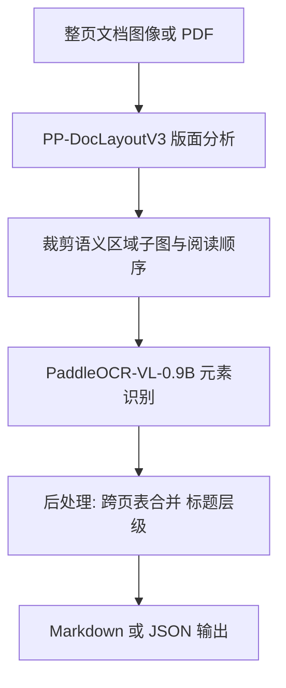
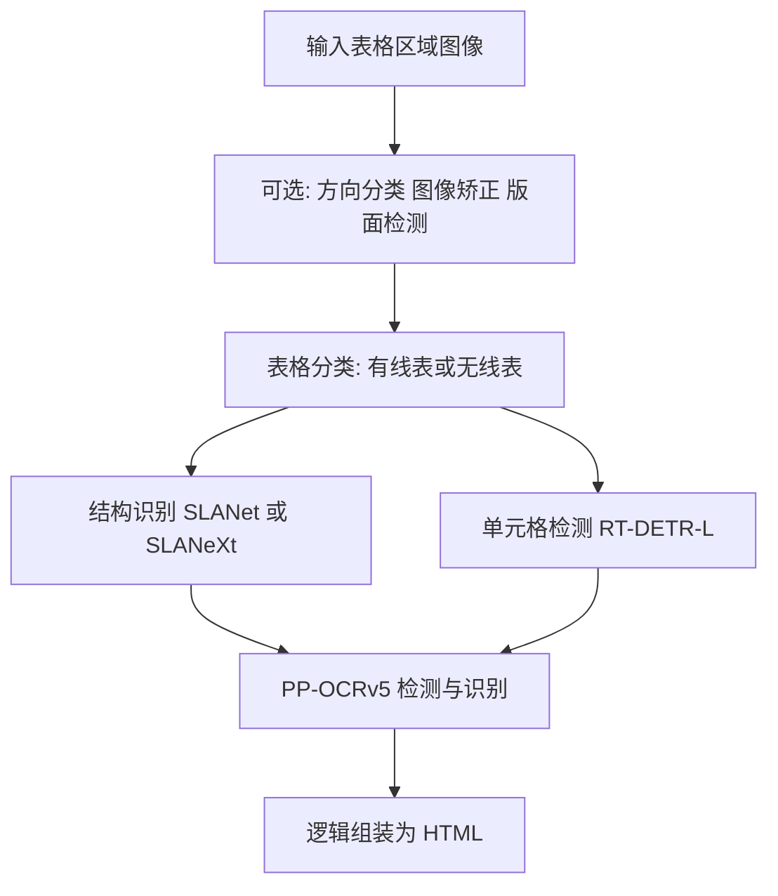
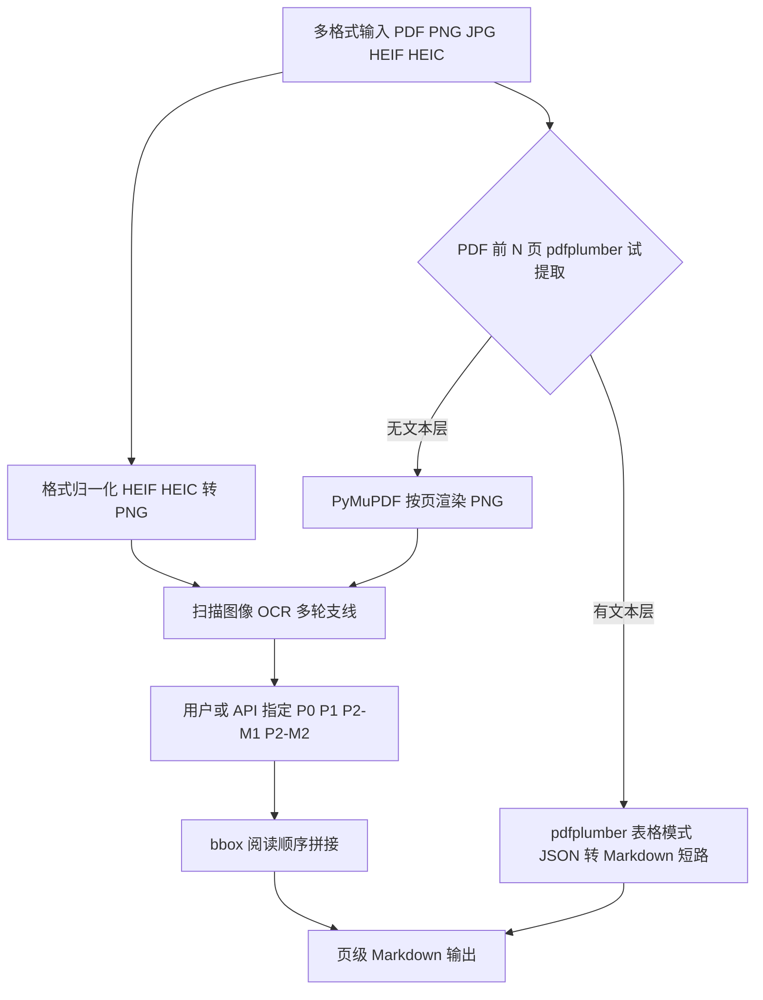
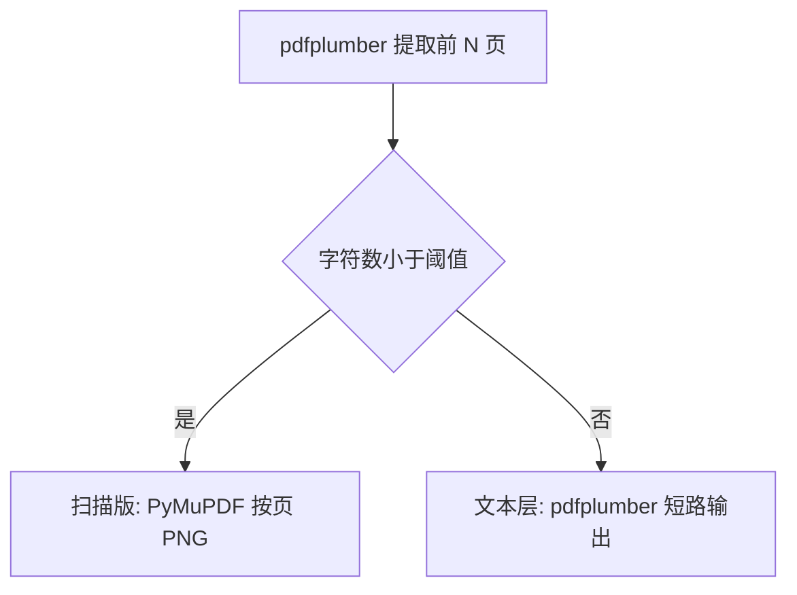
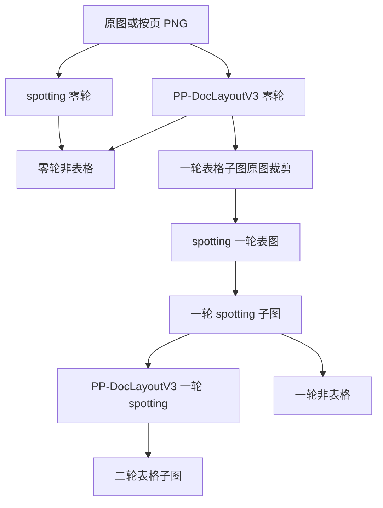
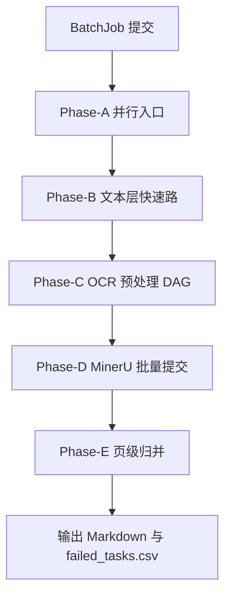
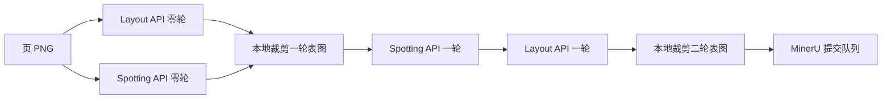

# 面向复杂版面的高精度文档解析：从 Pipeline OCR 到视觉语言模型协同架构

---

## 目录

- [摘要](#摘要)
- [1 引言](#1-引言)
  - [1.1 研究背景与问题陈述](#11-研究背景与问题陈述)
  - [1.2 PaddleOCR-VL-1.5](#12-paddleocr-vl-15轻量-vlm-与真实场景文档解析)
  - [1.3 MinerU2.5-Pro](#13-mineru25-pro-2604-12b数据引擎驱动的小参数-sota)
  - [1.4 PP-TableMagic 表格产线](#14-paddle-表格产线pp-tablemagic-与各模块能力)
  - [1.5 主要问题与挑战](#15-当前高精度-ocr--文档解析面临的主要问题)
  - [1.7 本文工作概要](#17-本文工作概要)
  - [1.8 本节小结与全文结构](#18-本节小结与全文结构)
- [3 方法：高精度文档解析方案](#3-方法高精度文档解析方案)
  - [3.1 系统总览](#31-系统总览)
  - [3.2 文档入口与格式归一化](#32-文档入口与格式归一化)
  - [3.3 扫描版复杂表格 OCR 多轮解析](#33-扫描版复杂表格-ocr-多轮解析)
  - [3.4 极度模糊文档适配](#34-极度模糊文档适配)
  - [3.5 页级输出与合并](#35-页级输出与合并)
- [4 轻量化产线方案](#4-轻量化产线方案)
  - [4.7 批量并行 API 调度流水线](#47-批量并行-api-调度流水线)
- [相关代码与文档](#相关代码与文档)
- [参考文献](#参考文献)
- [附录：写作与待填占位符](#附录写作与待填占位符)

---

## 摘要

光学字符识别（OCR）已从早期的字符级识别演进为面向整页文档的**智能解析**任务：在扫描件、拍照、PDF 及多栏混排等真实场景中，系统不仅需要高字符准确率，还需恢复**阅读顺序、表格结构、数学公式、图表语义**及适用于检索增强生成（RAG）与大语言模型（LLM）下游任务的**结构化表示**（如 Markdown、JSON）。然而，传统引擎（如 Tesseract）基于分割—识别的流水线，缺乏版式理解能力；单一端到端多模态大模型虽在复杂版式上表现突出，却面临显存占用高、幻觉风险及难以模块化优化等问题。近期产业界与开源社区形成了较为清晰的**两阶段协同范式**：第一阶段由专用版面分析模型完成区域检测、异形框定位与阅读顺序预测；第二阶段由紧凑视觉语言模型（VLM，参数量约 0.9B–3B）对各语义子图进行元素级识别，并通过后处理合并为完整文档。以 PaddleOCR-VL-1.5、MinerU、DeepSeek-OCR 及云厂商文档智能（Google Document AI、Azure Document Intelligence、AWS Textract）等为代表的主流方案，在 OmniDocBench 等公开基准上已将页级解析精度推升至 90% 以上，并在弯曲、倾斜、屏幕拍摄与复杂光照等「真实五类」退化条件下展现出显著鲁棒性。

本文围绕**高精度解析 OCR 方案**展开论述：首先系统梳理 OCR 三代技术路线——传统 OCR、深度学习检测—识别 Pipeline、以及版面—VLM 协同的文档智能架构，阐明各路线在精度、吞吐、可部署性与隐私合规上的权衡；其次从算法层面剖析版面分析（如基于 RT-DETR 的多点框与阅读顺序联合建模）、VLM 元素识别（动态分辨率视觉编码器 + 轻量语言模型）、以及 vLLM 等推理加速框架对端到端延迟与显存的影响；再次从工程层面比较开源自托管（PaddleOCR、MinerU Docker）、云端 API 与混合部署模式在批量处理、成本及数据主权方面的差异。在此基础上，本文归纳高精度文档解析的**关键设计原则**：（1）必须坚持「完整解析流水线」而非孤立调用 VLM，以避免版面错误引发的语义幻觉；（2）版面阶段的几何与顺序精度对下游识别具有级联放大效应；（3）针对表格、公式、印章等异构元素应采用分而治之的专用或提示化识别策略；（4）生产环境需将模型推理、服务编排与质量评测（字符错误率 CER、结构保真度、端到端任务成功率）纳入统一闭环。

本文的贡献在于：为面向复杂文档的高精度 OCR 研究提供**统一的问题定义、技术谱系与评测维度**，并为构建可复现、可扩展的解析系统给出从数据预处理、模型选型、GPU 推理加速到 API 服务化的参考路径。实验与讨论部分（请作者据实填写）将基于 [待填：基准数据集，如 OmniDocBench / 自建业务集] 对比 [待填：对比方法]，验证所提出或所综述方案在 [待填：指标，如 Edit Distance、TEDS、整体 F1] 上的有效性。研究表明，在算力可接受的前提下，**版面分析与小参数量 VLM 的协同设计**是当前实现高精度、低成本、可落地文档解析的最具性价比路径之一，而云—边—端混合架构则构成企业级智能文档处理（IDP）的主流形态。本文为 OCR 从「认字」走向「读懂文档」的范式迁移提供了理论梳理与工程参考，对 RAG、知识库构建及行业文档自动化具有直接借鉴意义。

**关键词**：光学字符识别；文档智能；版面分析；视觉语言模型；高精度解析；结构化抽取；OmniDocBench；检索增强生成；智能文档处理

---

## 1 引言

### 1.1 研究背景与问题陈述

高精度文档解析已成为大语言模型（LLM）训练数据构建、检索增强生成（RAG）与智能文档处理（IDP）的基础设施环节。与传统光学字符识别（OCR）仅追求字符转写不同，当代「解析」任务要求系统在复杂版式、多模态元素与真实成像退化条件下，恢复**阅读顺序、表格逻辑结构、数学公式、图表语义**以及可直接下游消费的 **Markdown / JSON / HTML** 等结构化表示。近年来，视觉语言模型（VLM）与专用版面分析模型的结合，推动文档解析从「检测—识别级联 Pipeline」向「版面—内容解耦协同」与「端到端文档理解」两条路线并行演进。要在工程与学术层面构建可对比、可复现的高精度解析方案，必须厘清当前最具代表性的开源系统及其模块级能力边界——尤其是 **PaddleOCR-VL-1.5**、**MinerU2.5-Pro-2604-1.2B** 以及 Paddle 生态中面向表格的 **通用表格识别 v2 产线（PP-TableMagic）** 各子模块的分工与互补关系。本文后续章节将在上述技术基线之上，展开我们所提出的高精度解析方案；本节则对三者进行系统性介绍，为全文奠定概念与术语基础。

---

### 1.2 PaddleOCR-VL-1.5：轻量 VLM 与真实场景文档解析

#### 1.2.1 定位与发布背景

**PaddleOCR-VL-1.5** 是百度飞桨团队于 2026 年 1 月发布的文档解析旗舰模型，参数量约 **0.9B**，在公开基准 **OmniDocBench v1.5** 上报告 **94.5%** 的整体精度，并面向 **扫描、倾斜、弯折、屏幕拍摄、复杂光照** 等五类真实退化场景进行专项优化。与仅强调字符错误率（CER）的传统 OCR 不同，PaddleOCR-VL-1.5 明确采用 **「版面分析 + 元素级 VLM 识别 + 结构化后处理」** 的完整产线范式：单独调用 VLM 权重或通过 OpenAI 兼容接口直推整页图像，均不能等价于官方完整流程，否则易出现版面错位引发的语义幻觉与结构丢失。

#### 1.2.2 两阶段协同架构

**阶段一：PP-DocLayoutV3**

| 能力维度 | 技术要点 | 意义 |
|----------|----------|------|
| 几何表示 | 多点框 / 四边形 / 多边形（rect / quad / poly / auto） | 适配倾斜、透视、弯折、拍照畸变 |
| 统一建模 | 单一 Transformer 内联合 **检测、实例分割、阅读顺序预测** | 减少「检测→排序」级联误差 |
| 推理效率 | 相对自回归大 VLM 做版式，显著降低延迟 | 适合产线化与高页数 PDF |

**阶段二：PaddleOCR-VL-1.5-0.9B**

- **NaViT 风格动态分辨率视觉编码器**：对不同尺度、不同长宽比的子图自适应编码；
- **ERNIE-4.5-0.3B 语言解码器**：承担文本、表格、公式等序列化输出；
- **多任务扩展（1.5 相对 1.0）**：文档解析 + **文本定位（Text Spotting）** + **印章识别** 等。

#### 1.2.3 功能能力清单

| 能力模块 | 说明 |
|----------|------|
| 异形框定位 | 多边形/四边形区域定位，针对「歪文档」稳定输出 |
| 表格 / 公式 / 图表 | VLM 专用提示与分辨率策略；可选 `--use_chart_recognition` |
| 印章识别 | v1.5 新增 `--use_seal_recognition` |
| 文档预处理 | 方向分类（0°/90°/180°/270°）、文本图像矫正（UVDoc） |
| 多语言 | 支持 **109–111** 种语言 |
| 长文档 | **跨页表格合并**、**多级标题重建**（`restructure_pages`） |
| 输出格式 | 默认 Markdown + JSON |
| 推理加速 | VLM 可接 **vLLM / SGLang**；版面分析仍在 Paddle 侧本地执行 |

#### 1.2.4 技术谱系中的位置

PaddleOCR-VL-1.5 属于 **「解耦式 VLM 文档解析」** 路线：保留 Pipeline 可控性，同时用 0.9B 级 VLM 提升元素识别上限。优势在于 **部署成本、可解释性与真实场景鲁棒性（尤其异形框）**。

---

### 1.3 MinerU2.5-Pro-2604-1.2B：数据引擎驱动的小参数 SOTA

#### 1.3.1 定位与核心主张

**MinerU2.5-Pro-2604-1.2B**（简称 **MinerU2.5-Pro**）是 OpenDataLab 团队 2026 年发布的文档解析 VLM 权重，参数量 **1.2B**，在 **OmniDocBench v1.6** 上取得 **95.69** 的综合得分——在不改变 MinerU2.5 网络结构的前提下，仅通过 **数据工程与三阶段训练策略** 将同架构基线从 **92.98 提升至 95.69（+2.71）**。

#### 1.3.2 模型架构

| 组件 | 规格 | 作用 |
|------|------|------|
| 视觉编码器 | **NaViT-675M** | 原生分辨率文档图像编码 |
| 语言模型 | **Qwen2-0.5B** | 结构化 Markdown 生成 |
| 范式 | **解耦式 VLM** | 模型内协调版面分析与内容识别 |

#### 1.3.3 数据引擎

- **DDAS**：训练规模扩展至 **65.5M** 页，强化长尾场景采样；
- **CMCV**：异构模型输出一致性评估样本难度；
- **Judge-and-Refine**：难例渲染—验证—迭代修正标注；
- **三阶段训练**：大规模预训练 → 难例微调 → **GRPO 格式对齐**。

#### 1.3.4 与 PaddleOCR-VL-1.5 对比

| 对比项 | PaddleOCR-VL-1.5 | MinerU2.5-Pro |
|--------|------------------|---------------|
| 参数量 | ~0.9B VLM + 独立版面 | 1.2B 统一架构 |
| 版面 | **PP-DocLayoutV3** 独立模块 | 模型内解耦式版面—内容 |
| 精度报告 | OmniDocBench **v1.5：94.5%** | OmniDocBench **v1.6：95.69** |
| 主要创新 | 异形框 + 多任务 0.9B VLM | **数据引擎** + 评测协议 v1.6 |
| 工具形态 | PaddleOCR 产线 / Docker | MinerU 工具链 + 云端 API |

---

### 1.4 Paddle 表格产线：PP-TableMagic 与各模块能力

表格是高精度文档解析中 **误差最敏感、结构恢复最难** 的要素之一。PaddleOCR 提供 **通用表格识别 v2 产线（PP-TableMagic）**，采用 **「表格分类 → 结构识别 / 单元格检测 → 文本检测识别 → HTML 组装」** 策略。

#### 1.4.1 产线总体流程

#### 1.4.2 核心模块

| 模块 | 默认模型 | 能力 |
|------|----------|------|
| 表格分类 | PP-LCNet_x1_0_table_cls | 有线/无线判别（Acc ~94.2%） |
| 结构识别 | SLANet / SLANeXt_wired/wireless | 行列逻辑结构与单元格关系 |
| 单元格检测 | RT-DETR-L_wired/wireless_table_cell_det | 合并单元格、不规则网格 |
| 单元格 OCR | PP-OCRv5_server_det/rec | 密集文本识别 |

#### 1.4.3 启示

1. **分类型建模**（有线表/无线表）优于单一结构头；
2. **结构 + 检测 + OCR 三级串联** 在 TEDS 指标上仍是强基线；
3. **模块独立训练与部署** 便于领域微调。

VLM 产线与表格 Pipeline 形成 **互补双轨**：VLM 负责版式与语义，表格 Pipeline 负责 TEDS 敏感场景或 **VLM 失败回退**。

---

### 1.5 当前高精度 OCR / 文档解析面临的主要问题

#### 1.5.1 任务定义与评测口径不统一

| 表述 | 实际含义 | 风险 |
|------|----------|------|
| 低 CER / Edit Distance | 字符转写正确 | 无法反映表格结构、阅读顺序 |
| 页级解析分数 | 版面 + 多元素综合 | 匹配规则不一致时可 **不可比** |
| Markdown 可读性 | 人眼/LLM 可用 | 与 TEDS、CDM 等结构指标可能脱节 |

#### 1.5.2 完整产线与「仅 VLM」混用导致的精度假象

常见误用：将 VLM 当作「看图说话」接口，忽略版面检测与阅读顺序。后果：**幻觉段落、错序阅读、表格错位**。

#### 1.5.3 级联误差与多模块协同难题

典型失效：版面框偏移、表格分类路由错误、跨页表格全局不一致。

#### 1.5.4 数据覆盖与难例标注的「天花板效应**

多种 SOTA 在 **同一批困难样本** 上失败模式高度相似，指向 **训练数据共性缺陷**。仅靠扩大参数难以突破；数据工程成为与架构创新并列的主攻方向。

#### 1.5.5 表格、公式、图表等结构化元素的「最后一公里」

| 元素 | 主要难点 |
|------|----------|
| 有线/无线表 | 类型判别、合并单元格、嵌套 |
| 公式 | 行内/独立公式、印刷 vs 手写 |
| 图表 | 数据提取 vs 图像描述 |
| 印章/手写 | 领域特定 |

#### 1.5.6 部署资源、时延与工程碎片化

VLM 推理显存敏感；版面、表格 Pipeline、VLM 可能分布在不同容器；云端 API 与本地部署在成本、隐私上权衡困难。

#### 1.5.7 下游任务对齐与可信性（面向 LLM / RAG）

需要块级元数据、低幻觉可校验输出、跨页逻辑合并；当前系统对引用溯源、增量更新、人工审核接口支持不足。

#### 1.5.8 与本研究的关系

§1.2–§1.4 代表三条成熟路径，但均未单独解决全部瓶颈——尤其 **复杂表格结构恢复** 与 **极度模糊扫描文档**。本文在 **复用与编排现有开源能力** 的前提下，形成可落地、可切换的两套解析路径（见 §1.7）。

---

### 1.7 本文工作概要

#### 1.7.1 面向复杂表格与极度模糊文档的开源能力编排方案

- **不重复造轮子**：协同 PaddleOCR-VL / PP-StructureV3、PP-TableMagic、MinerU 等，按文档类型与置信度 **路由与回退**；
- **难点定向增强**：表格敏感场景走 **表格模块化产线**；版式复杂页面结合 **异形框版面 + 多任务 VLM**；模糊区域降低检测阈值；
- **流程可验证**：强调 **完整产线调用**，输出可复现的结构化 Markdown / HTML。

#### 1.7.2 轻量化产线方案

- 以 **云端 API** 替代本地 GPU 部署（Paddle AI Studio + MinerU 精准解析 API）；
- **保留完整裁剪 + P0–P2 编排**，与高精度路径 **同构、可切换**；
- 以 AI Studio **spotting Job** 替代本地 VLM spotting（轻量实现中）。

#### 1.7.3 贡献陈述

1. **问题梳理**：归纳高精度文档解析在评测、级联误差、数据天花板、结构化元素与部署等方面的挑战（§1.5）；
2. **开源编排方案**：针对复杂表格与极度模糊文档，给出可复现高精度解析流程（第 3 章）；
3. **轻量化产线**：提供同构、可切换的轻量产线设计（第 4 章）；
4. **实验与对比**（后续章节）：在 [待填：数据集] 上与基线对比验证。

---

### 1.8 本节小结与全文结构预告

| 章节 | 内容 |
|------|------|
| 第 1 章 | 引言（本文） |
| 第 3 章 | **高精度编排方案**：开源模型选型、多轮 OCR、P0–P2 |
| 第 4 章 | **轻量化产线**：全 API、批量并行、资源—精度权衡 |
| 第 5–7 章 | 系统实现、实验、结论（待撰写） |

**技术基线小结**：

- **PaddleOCR-VL-1.5**：PP-DocLayoutV3 异形框 + 0.9B 多任务 VLM；
- **MinerU2.5-Pro**：1.2B + Data Engine，OmniDocBench v1.6 **95.69**；
- **PP-TableMagic**：表格分类—结构—检测—OCR 四模块协同。

---

## 3 方法：高精度文档解析方案

本章阐述面向 **复杂表格结构** 与 **扫描版/极度模糊文档** 的高精度解析方法，与 §1.7.1 对应。第 4 章给出与之 **同构、可切换** 的轻量化产线。

### 3.1 系统总览

#### 3.1.1 设计目标与架构定位

本文方法 **不从零训练单一超大模型**，而是在 **复用与编排现有开源能力** 的前提下，形成两套解析路径：

| 路径 | 部署形态 | 核心能力组合 |
|------|----------|--------------|
| **高精度路径（本章）** | 本地 / 自托管（Docker + vLLM） | PP-DocLayoutV3 + PaddleOCR-VL-1.5 spotting + MinerU2.5-Pro |
| **轻量路径（第 4 章）** | 全官网 API | AI Studio 版面/spotting + MinerU 云端精准解析 |

#### 3.1.2 端到端数据流

#### 3.1.3 符号与中间产物

| 符号 | 含义 |
|------|------|
| **零轮** | 以 **原图（或按页 PNG）** 为输入的第一阶段 |
| **一轮** | 以 **一轮表格子图**（自原图裁剪）为输入 |
| **二轮** | 以 **二轮表格子图**（自一轮表格子图再裁剪）为输入 |
| **spotting 子图** | 同尺寸空白画布 + spotting 映射的文字 |
| **非表格解析结果** | 版面 label 非 `table` 区域内按空间顺序回填的文本 |
| **P0–P2** | 四条总解析路径（§3.3.5） |

---

### 3.2 文档入口与格式归一化

#### 3.2.1 支持格式

`PDF`, `PNG`, `JPG`, `JPEG`, `HEIF`, `HEIC`

- **HEIF / HEIC**：heif-converter → PNG；
- **JPG / JPEG**：规范为 PNG 中间表示。

#### 3.2.2 PDF 类型判定

**暂不考虑混合 PDF**（同文档部分页文本层、部分页扫描）。

#### 3.2.3 文本层 PDF 短路路径

1. pdfplumber 开启表格提取；
2. 得到 JSON 中间表示；
3. JSON → Markdown 转换后作为最终输出；
4. **不进入** §3.3 OCR 多轮支线。

| JSON 内容 | Markdown 映射 |
|-----------|---------------|
| 纯文本块 | 段落，段间空行 |
| 表格 | Markdown 表格 |
| 多页 | 按页序拼接，页间 `---` 或 `# Page k` |

#### 3.2.4 扫描版 PDF 栅格化

PyMuPDF 按页渲染 PNG → 进入 §3.3 多轮 OCR。

---

### 3.3 扫描版复杂表格 OCR 多轮解析

#### 3.3.1 问题设定

**触发条件**：扫描版 PDF 按页 PNG，或复杂表单类扫描图像（如报关单）。

**核心矛盾**：单轮整页 VLM 解析效果与真值差距大，需 **多轮版面切分、spotting 保真与 MinerU 结构解析** 组合。

| 区域类型 | 处理目标 |
|----------|----------|
| **非表格** | 按版面标签 + 空间顺序回填文本 |
| **表格** | 零轮→一轮→二轮裁剪，经 MinerU 恢复结构 |

#### 3.3.2 零轮

1. **PP-DocLayoutV3**：输出 `table`、`text` 等 bbox；
2. **PaddleOCR-VL-1.5 spotting**：文字映射到 **零轮 spotting 子图**；
3. **零轮非表格解析结果**：非 table 区域按 bbox 阅读顺序回填。

#### 3.3.3 一轮

1. **一轮表格子图**：自 **原图** 裁剪所有 table 区域；
2. **一轮 spotting 子图**：对每个一轮表格子图 spotting → 空白画布；
3. **一轮非表格解析结果**：对一轮 spotting 子图再跑 PP-DocLayoutV3，回填非 table 区域。

#### 3.3.4 二轮

在一轮 spotting 子图版面中识别复杂表内部子表 → **回到一轮表格原图（非 spotting）** 二次裁剪 → **二轮表格子图**。

| | **P2-M1（偏文本）** | **P2-M2（偏结构）** |
|---|---------------------|---------------------|
| spotting | 二轮 spotting → **四向扩 5%** → MinerU | 无 spotting |
| MinerU 输入 | 二轮 spotting 扩充子图 | 二轮表格原图裁剪 |
| 权衡 | 牺牲部分表格结构，提高文本正确性 | 保留局部结构，牺牲文本准确度 |

#### 3.3.5 四条总解析路径（P0–P2）

| ID | 表格部分 | 非表格部分 | 说明 |
|----|----------|------------|------|
| **P0** | 原图直调 MinerU | 含于整页 MinerU 输出 | 基线/快速 |
| **P1** | 各 **一轮表格子图** → MinerU | **零轮** 非表格结果 | 表格不经 spotting 直解 |
| **P2-M1** | 各 **二轮 spotting 扩充子图** → MinerU | **零轮 + 一轮** 非表格 | 文本优先 |
| **P2-M2** | 各 **二轮表格子图** → MinerU | **零轮 + 一轮** 非表格 | 结构优先 |

**MinerU 约定**：多表 **逐张调用** 后合并进页级输出。

#### 3.3.6 多轮预处理流水线

---

### 3.4 极度模糊文档适配

极度模糊扫描件 **共用** §3.3 完整拓扑，**不**另设独立图像预处理管线（超分/去噪等）。

**适配策略**：调用 Paddle spotting / 文字检测时 **降低检测阈值**，提高模糊笔画召回。轻量路径通过 `--blur-sensitive` 联动 `layout_confidence_min` 与 API `optional_payload` 覆盖项。

---

### 3.5 页级输出与合并

#### 3.5.1 bbox 阅读顺序拼接

- 表格块（MinerU）与非表格块（零轮/一轮）按 **bbox 几何排序** 排列拼接；
- 恢复与原始版式一致的逻辑阅读顺序。

#### 3.5.2 多表格 MinerU 结果合并

1. 各表逐张送 MinerU；
2. 按表区域 bbox 插入阅读顺序；
3. 与非表格文本块合并为页级 Markdown。

#### 3.5.3 输出形态

| 来源 | 典型输出 |
|------|----------|
| 文本层 PDF | **Markdown**（pdfplumber JSON 转换） |
| 扫描/OCR 路径 | 页级 Markdown（`page_*.md` + `{doc_id}.md`） |

---

## 4 轻量化产线方案

对应 §1.7.2，与第 3 章 **同构、可切换**，面向 **算力受限、时延敏感或不愿本地部署 GPU** 的场景。

### 4.1 设计动机

| 能力 | 高精度（第 3 章） | 轻量产线（本章） |
|------|-------------------|------------------|
| 版面检测 | 本地 PP-DocLayoutV3 | **Paddle AI Studio 云端 API** |
| 文本定位 | PaddleOCR-VL-1.5 spotting | **AI Studio spotting Job** |
| 表格/页级深度解析 | 本地 MinerU2.5-Pro | **MinerU 云端精准解析 API** |

### 4.2 与高精度路径的同构关系

**保留完整多轮裁剪** 与 **P0–P2 四条路径**，逻辑与 §3.3 完全一致。

| 路径 | 轻量实现 |
|------|----------|
| **P0** | 原图 → MinerU 云端 API |
| **P1** | 一轮表格子图 → MinerU + 零轮非表格拼接 |
| **P2-M1** | 二轮 spotting 扩充子图 → MinerU + 零轮/一轮非表格 |
| **P2-M2** | 二轮表格子图 → MinerU + 零轮/一轮非表格 |

**共享入口**：§3.2 多格式接入、HEIF 转换、pdfplumber 判型、PyMuPDF 分页。

### 4.3 Spotting → 检测 + 识别（设计对照）

轻量实现以 **AI Studio spotting Job**（`promptLabel: spotting`, `useLayoutDetection: false`）替代本地 VLM spotting，仍生成 **空白映射子图** 供后续切分。

### 4.5 模式切换

| 参数 | 含义 |
|------|------|
| `mode=high_precision` | 第 3 章本地产线（待实现） |
| `mode=lightweight` | 第 4 章全 API 产线（已实现） |
| `parse_path=P0\|P1\|P2-M1\|P2-M2` | 四条总解析路径 |
| `blur_sensitive=true` | 降低检测/版面阈值 |

---

### 4.7 批量并行 API 调度流水线

#### 4.7.1 设计目标

| 目标 | 手段 |
|------|------|
| 提高 API 利用率 | 多文档、多页、多子图并发 |
| 减少 MinerU 往返 | 跨页/跨文档 **batch_upload** 聚合 |
| 控制限流 | 分端点 QPS 令牌桶 |
| 结果可追踪 | `(doc_id, page_id, artifact_id, path)` 元数据 |

#### 4.7.2 批作业生命周期

#### 4.7.3 任务 DAG

#### 4.7.4 MinerU 批量聚合

1. Phase-C 将所有 MinerU 待解析图像写入全局队列；
2. 按 `mineru_batch_size` 触发 `batch_upload_files`；
3. `wait_batch` 完成后按元数据回填；
4. 单页逻辑上逐表解析，物理上批量 HTTP 完成。

#### 4.7.5 Paddle API 并发池

| 池 | 职责 |
|----|------|
| LayoutPool | 零轮 / 一轮 spotting 图上的版面 API |
| SpottingPool | AI Studio spotting Job |
| LocalPool | HEIF、PyMuPDF、裁剪、JSON→MD、空白图映射 |

#### 4.7.6 失败、重试与部分成功

| 场景 | 策略 |
|------|------|
| Paddle API 失败 | 指数退避重试；超限标记 `page_failed` |
| MinerU 部分失败 | 重提失败子图新 batch |
| pdfplumber 失败 | 可选降级为扫描支路 |

输出：**成功文档 Markdown** + **`failed_tasks.csv`**。

#### 4.7.7 配置参数

| 参数 | 含义 |
|------|------|
| `max_parallel_docs` | 同时处理文档数 |
| `max_parallel_pages` | 单文档并发页数 |
| `paddle_layout_qps` / `paddle_spotting_qps` | Paddle 端限流 |
| `mineru_batch_size` | MinerU 聚合上限 |
| `retry_attempts` / `retry_delay_sec` | API 重试 |

---

## 相关代码与文档

### 轻量产线代码（已实现）

仓库路径：**[`lightweight_pipeline/`](../../lightweight_pipeline/)**

| 文件 | 说明 |
|------|------|
| [`run.py`](../../lightweight_pipeline/run.py) | CLI 入口 |
| [`config.example.yaml`](../../lightweight_pipeline/config.example.yaml) | 脱敏配置模板（复制为 `config.yaml`，勿提交密钥） |
| [`lp/batch_pipeline.py`](../../lightweight_pipeline/lp/batch_pipeline.py) | 批处理主流程 |
| [`lp/core/rounds.py`](../../lightweight_pipeline/lp/core/rounds.py) | 零/一/二轮 OCR |
| [`lp/core/merge.py`](../../lightweight_pipeline/lp/core/merge.py) | bbox 合并 |
| [`mineru_precision_api.py`](../../mineru_precision_api.py) | MinerU 客户端（仓库根目录） |

详细说明见 **[`lightweight_pipeline/README.md`](../../lightweight_pipeline/README.md)**。

### 论文章节源文件（本文整理来源）

| 文件 | 原章节 |
|------|--------|
| [`abstract.md`](abstract.md) | 摘要 |
| [`introduction.md`](introduction.md) | 第 1 章 引言 |
| [`method.md`](method.md) | 第 3–4 章 方法 |

---

## 参考文献

1. Cui et al., *PaddleOCR-VL-1.5: Towards a Multi-Task 0.9B VLM for Robust In-the-Wild Document Parsing*, arXiv:2601.21957, 2026.
2. Wang et al., *MinerU2.5-Pro: Pushing the Limits of Data-Centric Document Parsing at Scale*, arXiv:2604.04771, 2026.
3. PaddleOCR Documentation: PaddleOCR-VL, PP-StructureV3, Table Recognition v2 (PP-TableMagic).
4. OpenDataLab MinerU: https://github.com/opendatalab/MinerU
5. HuggingFace: `PaddlePaddle/PaddleOCR-VL-1.5`, `opendatalab/MinerU2.5-Pro-2604-1.2B`, `PaddlePaddle/PP-DocLayoutV3`
6. pdfplumber, PyMuPDF, heif-converter 官方文档.
7. MinerU 云端精准解析 API 文档（含 `batch_upload_files` / `wait_batch`）。
8. vLLM: Easy, Fast, and Cheap LLM Serving.

---

